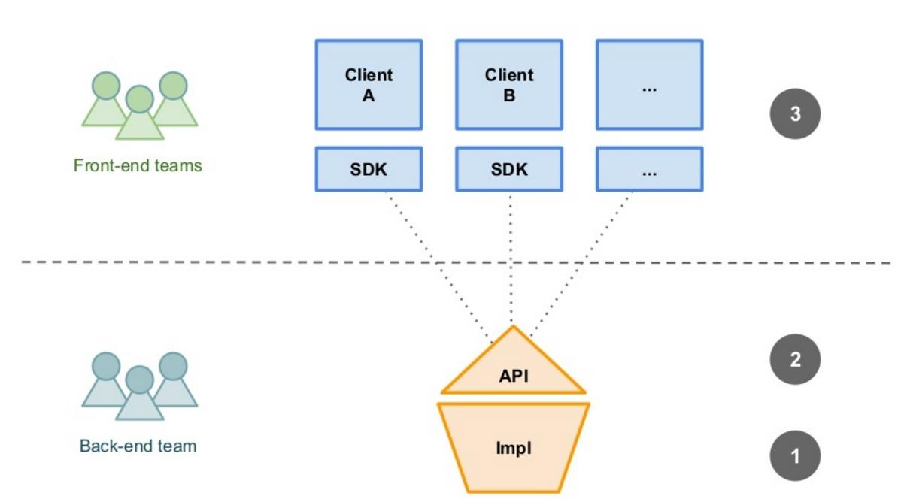
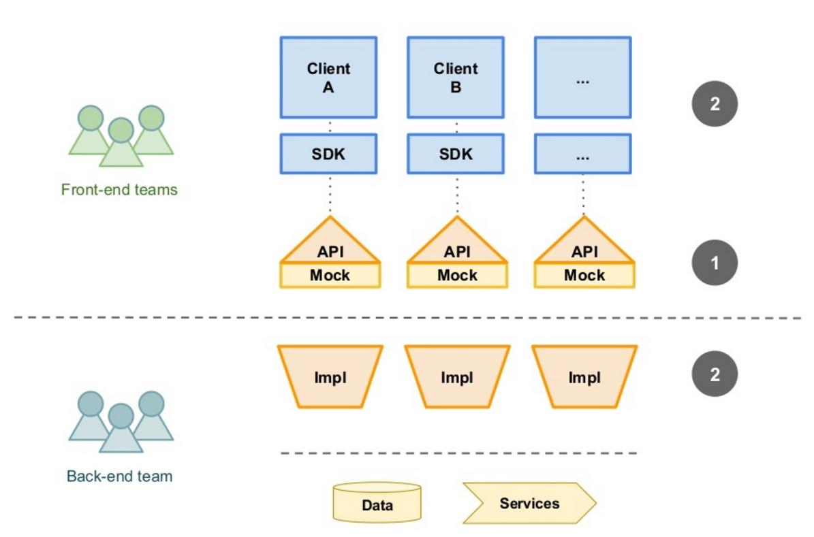

# API First

## Why REST APIs?

Right now, developers are working with Google’s Android Auto API to integrate messaging and control audio inside of [Google’s driverless car](https://developer.android.com/auto/).

Visa is attempting to be everywhere you are by opening up their API for increased financial accessibility.

And a few industrious hackers have even reverse engineered the private Tinder API to go on more dates.

The API economy is growing rapidly and companies are joining the fray in making APIs an integral part of their growth strategies.

Tech giants like Apple and Google are gearing towards an API-centric future.

The surfacing of new interconnected hardware, wearables, and soon driverless cars shows how important APIs are in our lives.

## What Is API-First?

A lot of companies start with building web or mobile applications, and only then as a side project they build an API for third-party companies or for integration purposes.

They see it then as two channels: one web or mobile channel and one API channel.

The problem with this approach is that it results in an artificial API that wasn't properly built and tested during design.

A better approach is to build the API first and build your web or mobile applications on top of that API.

This forces you to design an API and use it for your own app so that it's a more real-world and developer-friendly REST API.

API-first development is a strategy in which the first order of business is to develop an API that puts your target developer’s interests first and then build the product on top of it (be it a website, mobile application, or a SaaS software).

By building on top of APIs with developers in mind, you and your developers are saving a lot of work while laying down the foundations for others to build on.

## Why API-First Development?

A development process is currently not parallel, but synchronous.

Once a new service or a new feature is in a need for development, the R&D teams are starting to work on the design.

Once done, the backend team is starting to write a prototype (other teams like frontend and Q&A are waiting).

Once the prototype is done, an API document can be prepared and shared with the different teams (Q&A, frontend).

When change is needed because of a feature, bug, improvement, or enhancement, this cycle will begin again, wasting valuable development time and decreasing time-to-market for the new service.

As you can see in the picture above, first, the back-end team is starting to develop and implement a new API.

Second, the API is being given to the front-end teams and testers for using and testing it.

Third, the front-end teams and testers are building SDKs, tests, and more to interact with the API.

This is synchronous development.

API-first development will allow parallel development by all teams without the need to wait for changes to be released by one team or another.

In the picture above, we can see that the first APIs that are created are mocks.

Second, both back-end, front-end, and test teams are starting to work with the mocked APIs.

Once the API is ready, all teams can switch to the production or staging API.

This saves a lot of development time.

## Building Services API-First

These days, the concept of mobile first is gaining a lot of traction.

It refers to the notion that from the very beginning of your project, everything you do revolves around the idea that what you are building is a product to be consumed by mobile devices.

Similarly, API-first means that what you are building is an API to be consumed by client applications and services.

Every decision you make and every line of code you write is the notion that every functional requirement of your application will be met through the consumption of an API.

Even a user interface, be it web or mobile, is really nothing more than a consumer of an API.

By designing your API first, you are able to facilitate discussion with your stakeholders (your internal team, customers, or possibly other teams within your organization who want to consume your API) well before you might have coded yourself past the point of no return.

This collaboration then allows you to build user stories, mock your API, and generate documentation that can be used to further socialize the intent and functionality of the service you’re building.

These days, you’ll find that there are myriad tools and standards to support API-first development.

There is a standard format for API specification that uses a markdown-like syntax called Swagger.

This format can be used by code to generate documentation, SDKs and even mock servers, which are invaluable in testing service ecosystems.
