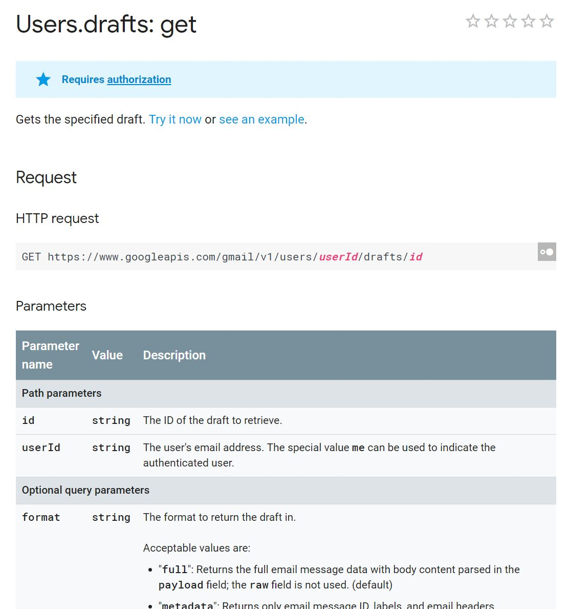
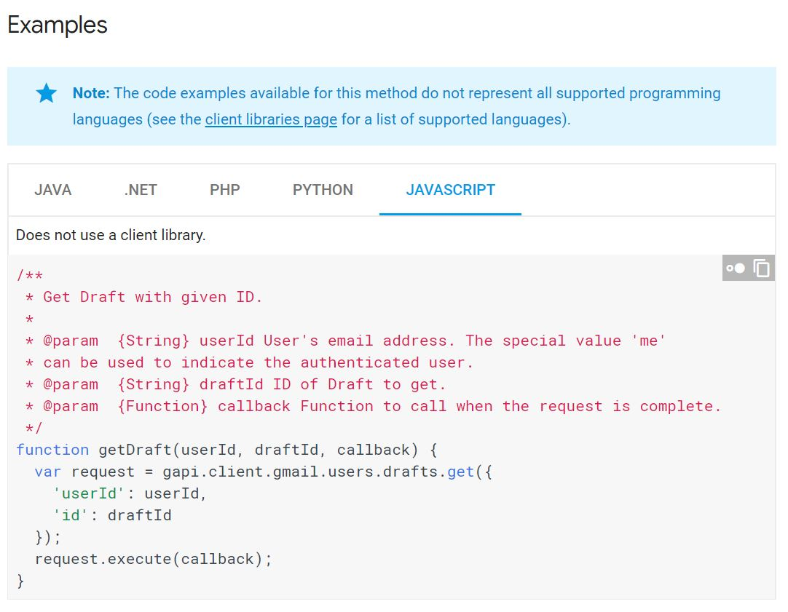

# Documentation

API documentation needs to be up-to-date and accurate. Adopting the [OpenAPI 2.0](https://github.com/OAI/OpenAPI-Specification/blob/master/versions/2.0.md) standard should greatly aid in improving API documentation. That standard required documenting all APIs, including resource structure, query, header and body parameters as well as response format, and result codes. This data can be used to automatically generate documentation which accurately reflects the API, as designed.

## Mapping API concepts to user concepts

The current documentation does a good job explaining the resources, parameters, headers and bodies required to make a call. It is less useful when trying to figure out workflows for higher-level tasks. For example, if a user wants to traverse the reference structure of a Fusion360 external reference item, how would he use the Forge Data Management API to accomplish that? There is much discussion of _refs_ and _relationships_ but very little, or no, discussion of how those things map to user concepts seen in BIM360 or Fusion Team. See the docs for Forge DM [GET projects/:project_id/items/:item_id/refs](https://developer.api.autodesk.com/en/docs/data/v2/reference/http/projects-project_id-items-item_id-refs-GET/) for an example of this. There is an example, with a huge response body, but no documentation of how to interpret that response, and how it maps to user concepts like external references in Fusion360.

## Navigation

Why is there no _search_ feature on the Forge web site?
How do I easily find sample code that uses a particular API?

## Example Usage
Current Forge documentation is also weak in the are of demonstrating usage. All examples are given using __curl__, which is accurate, but not as much help if the developer is using an SDK to invoke the API. A better solution is to give examples from all the major SDKs in addition to the curl sample. Google's API documentation offer an excellent example of this.

## ...
 

## Sample Code

The sample code for Forge seems to be of varying quality. Some examples, make raw HTTP calls, and some use client SDKs for example. They do not follow a common format. It would be extremely helpful for the API reference to have links to sample code that uses an API, in various languages.
